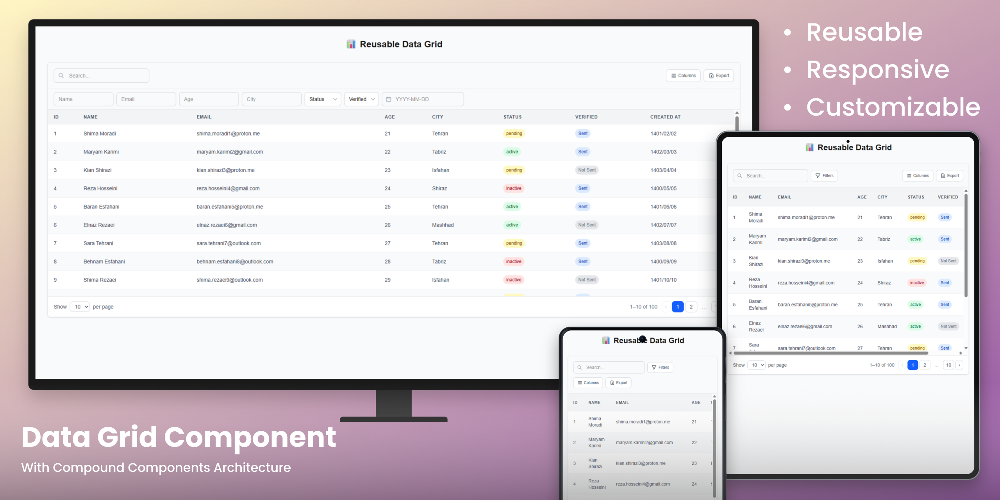

# Reusable Data Grid Module

A production-ready, highly customizable Data Grid component built with **Next.js**, **TypeScript**, and **Tailwind CSS**. Designed to be reused across multiple enterprise projects with minimal configuration.

---

## 🚀 Quick Start

```bash
git clone [https://github.com/GizNouv/Reusable-Data-Grid.git]
cd reusable-data-grid
npm install
npm run dev
```

Open http://localhost:3000 to see the demo.
The project uses Next.js API Routes as a mock backend. No additional setup is needed.

---

## ✨ Features

- **Compound Component Architecture** — simple default layout or full custom composition
- **Server-side Pagination, Sort, & Filter** — scales to millions of records
- **Multiple Filter Types** — text, number, select, boolean, date (Jalali)
- **Responsive Filter System** — inline on desktop, popover on mobile, active filter tags with remove buttons
- **Column Visibility Toggle** — show/hide columns, persisted to localStorage
- **CSV & Excel Export** — zero external dependencies
- **Sticky Header & Columns** — with dynamic scroll-aware shadow
- **Three Density Modes** — compact, standard, comfortable
- **URL Synchronization** — shareable URLs with page, sort, and filter state
- **State Persistence** — density and column visibility saved to localStorage
- **Custom Slot Renderers** — replace loading, empty, and error states with your own components
- **HeroUI v3 ClassNames API** — style any part without touching component internals
- **TypeScript Generics** — full type safety with inferred column keys
- **Skeleton Loading** — atomic skeleton primitive, composable anywhere

---

## 📁 Architecture
```
src/
├── app/
│ ├── api/data/route.ts # Mock API endpoint
│ ├── page.tsx # Entry point (server component)
│ └── layout.tsx # Root layout
│
├── components/
│ ├── data-grid/
│ │ ├── DataGrid.tsx # Main orchestrator & context provider
│ │ ├── Toolbar.tsx # Toolbar wrapper
│ │ ├── SearchInput.tsx # Global text search
│ │ ├── FilterComboBox.tsx # Single column filter
│ │ ├── Filters.tsx # Auto-generates all filters
│ │ ├── FilterPopover.tsx # Mobile filter popover
│ │ ├── FilterTags.tsx # Active filter tags
│ │ ├── ColumnVisibilityToggle.tsx # Show/hide columns
│ │ ├── ExportButton.tsx # CSV/Excel export
│ │ ├── Table.tsx # Scrollable table container
│ │ ├── Header.tsx # Sortable sticky header
│ │ ├── Body.tsx # Table body + states
│ │ ├── Row.tsx # Single data row
│ │ ├── Cell.tsx # Renders value by cellType
│ │ ├── Pagination.tsx # Pagination wrapper
│ │ ├── PageSizeSelector.tsx # Rows per page
│ │ ├── PageInfo.tsx # "1–10 of 100" display
│ │ ├── PageButtons.tsx # Page numbers + ellipsis
│ │ └── states/
│ │ ├── Skeleton.tsx # Reusable skeleton primitive
│ │ ├── LoadingState.tsx # Skeleton table
│ │ ├── EmptyState.tsx # No data placeholder
│ │ └── ErrorState.tsx # Error + retry button
│ └── demo/
│ └── DataGridDemo.tsx # Usage example
│
├── context/
│ └── DataGridContext.tsx # React context + useDataGridContext
│
├── hooks/
│ ├── useExportData.ts # CSV/Excel export logic
│ ├── useStickyOffsets.ts # Sticky column offset calculation
│ ├── useUrlSync.ts # URL query parameter sync
│ └── usePersist.ts # localStorage persistence
│
├── lib/
│ ├── cn.ts # Classname merge utility
│ ├── mock-data.ts # 100 sample records
│ └── utils.ts # Filter, sort, paginate, formatJalaliDate
│
└── types/
└── data-grid.types.ts # All TypeScript type definitions
```
### Layer Responsibilities

| Layer | Purpose |
|-------|---------|
| **types/** | All TypeScript interfaces — the shared contract for the entire module |
| **context/** | Global state management — eliminates prop drilling between compound components |
| **hooks/** | Isolated business logic — reusable across components, fully testable |
| **components/** | UI layer — compound components that consume context |
| **lib/** | Pure utility functions — no React dependency, testable in isolation |

---

## 🧠 Technical Decisions

### Compound Components Pattern

The DataGrid uses a **compound component** architecture rather than a single component with many props.

**Why:**
- Users can use the **default layout** with zero configuration
- Advanced users can **compose** their own layout by rearranging sub-components
- Custom elements can be **inserted** between toolbar, table, and pagination
- Unused features can be **removed** by simply omitting the sub-component
- Follows patterns used by MUI, Radix UI, and Headless UI

**Example:**
```tsx
// Simple usage — default layout
<DataGrid columns={columns} fetchData={fetchData} />

// Compound usage — full control
<DataGrid columns={columns} fetchData={fetchData}>
  <DataGrid.Toolbar>
    <DataGrid.SearchInput />
    <DataGrid.Filters />
    <DataGrid.ExportButton />
  </DataGrid.Toolbar>
  <DataGrid.Table />
  <DataGrid.Pagination />
</DataGrid>
```

### Context API for State Management

All internal state is managed through React Context.

**Why:**
- Sub-components access shared state without prop drilling
- Adding new sub-components requires no changes to existing ones
- Single source of truth for page, sort, filters, visibility, and density
- Components like `Header`, `Body`, `Row`, and `Cell` access state independently

### Server-side Pagination, Sort, and Filter

All data operations happen on the server side by default.

**Why:**
- Scales to millions of records without loading everything into the browser
- Matches real enterprise backend patterns (SQL `LIMIT/OFFSET`, `ORDER BY`, `WHERE`)
- The `fetchData` callback is fully controlled by the consumer — works with any API
- Mock API demonstrates the exact contract needed from a real backend

### Tailwind CSS

Styling uses Tailwind CSS exclusively.

**Why:**
- Zero runtime CSS — all styles are build-time generated
- Utility classes are highly composable
- Easy to customize via `classNames` prop without touching component internals
- No CSS-in-JS runtime overhead
- Consistent design tokens across the entire grid

### TypeScript Generics

The entire module is built with generic TypeScript types.

**Why:**
- `ColumnDef<TData>` ensures column keys match the actual data shape
- `fetchData` return type is inferred from the generic parameter
- Type safety when accessing row values in custom renderers
- IDE autocompletion for all column keys and filter fields

### Custom Hooks for Complex Logic

Logic is extracted into focused custom hooks.

**Why:**
- `useStickyOffsets` — reads actual column widths from DOM, handles resize, avoids hydration mismatches
- `useUrlSync` — debounced URL updates with duplicate prevention
- `usePersist` — localStorage with SSR safety
- `useExportData` — CSV/Excel generation without external libraries
- Each hook is independently testable and reusable

### Next.js API Routes for Mock Backend

The mock API is built into the Next.js project itself.

**Why:**
- No external server needed — `npm run dev` is all you need
- Demonstrates the exact API contract (query parameters, response shape)
- Simulates real-world latency (300ms delay)
- Simulates error scenarios (10% random error rate)
- Filter, sort, and paginate logic mirrors real SQL queries

---

## 🎨 Customization

### Props API

```typescript
<DataGrid
  columns={columns}                  // Column definitions (required)
  fetchData={fetchData}              // Data fetching function (required)
  defaultPageSize={10}               // Initial rows per page
  syncWithUrl                        // Enable URL synchronization
  stickyHeader                       // Sticky header on vertical scroll
  stickyColumns={{ left: ['id'] }}   // Sticky columns with scroll shadow
  hideHeader                         // Hide the table header
  enableExport                       // Show CSV/Excel export button
  density="standard"                 // compact | standard | comfortable
  columnVisibility={...}             // Controlled column visibility
  onColumnVisibilityChange={...}     // Visibility change handler
  classNames={{...}}                 // Custom CSS classes per slot
  slots={{...}}                      // Custom renderers for states
/>
```
### ClassNames API

Override styles for any part of the grid without touching component internals:

```typescript
classNames={{
  base: "rounded-xl",
  table: "border-separate",
  thead: "bg-gray-200",
  th: "text-sm font-bold",
  tbody: "divide-y",
  tr: "hover:bg-blue-100",
  td: "py-4",
  toolbar: "bg-white",
  pagination: "border-none",
  loadingWrapper: "min-h-[400px]",
  emptyWrapper: "bg-yellow-50",
  errorWrapper: "bg-red-50",
}}
```
### Slot Renderers

Replace loading, empty, and error states with your own components:

```typescript
slots={{
  loadingRenderer: () => <MyCustomSpinner />,
  emptyRenderer: () => <MyEmptyIllustration />,
  errorRenderer: (message, retry) => (
    <MyErrorBanner message={message} onRetry={retry} />
  ),
}}
```
### Boolean Cell Customization

Customize boolean display per column:

```typescript
{
  accessorKey: "isVerified",
  cellType: "boolean",
  booleanConfig: {
    trueLabel: "Sent",
    falseLabel: "Not Sent",
    trueClassName: "bg-blue-100 text-blue-800",
    falseClassName: "bg-gray-200 text-gray-500",
  },
}
```
### Custom Cell Renderers

Render any custom JSX for a column:

```typescript
{
  accessorKey: "status",
  cellType: "custom",
  customRenderer: (row) => (
    <span className={`badge badge-${row.status}`}>
      {row.status}
    </span>
  ),
}
```
### Column Filter Configuration

Define how each column can be filtered:

```typescript
{
  accessorKey: "status",
  header: "Status",
  filterable: true,
  filterDef: {
    type: "select",
    options: [
      { label: "Active", value: "active" },
      { label: "Inactive", value: "inactive" },
    ],
  },
}
```
---

## 🧩 Extensibility Points

The following features can be added without architectural changes:

| Feature | How to Add | Uses Existing |
|---------|-----------|---------------|
| **Action Column** | New `ActionColumn` component with edit/delete buttons, consume row from context | Context, Row |
| **Density Selector UI** | New `DensitySelector` component, call `setDensity` from context | usePersist, context |
| **Drag & Drop Columns** | Add drag handlers to `Header` component, reorder `columns` state | Header, context |
| **Row Selection** | Add `selectedRows` state to context, checkbox in `Row` component | Context, Row |
| **Inline Editing** | Add `editingCell` state, double-click handler in `Cell` component | Cell, context |
| **Virtual Scrolling** | Replace `tbody` rendering with a virtual list library | Body, data |
| **i18n Support** | Replace hardcoded strings with translation keys | All components |
| **Column Resizing** | Add resize handles to `th` elements, store widths in state | Header |
| **Server-side Search** | Search is already sent in `FetchParams` — just implement on your backend | fetchData |

---

## 📦 Tech Stack

| Technology | Purpose |
|-----------|---------|
| Next.js 15+ | Framework (App Router) |
| React 19+ | UI library |
| TypeScript 5+ | Type safety |
| Tailwind CSS 4+ | Styling |
| date-fns-jalali | Jalali date formatting |

---

## 📄 License

MIT
